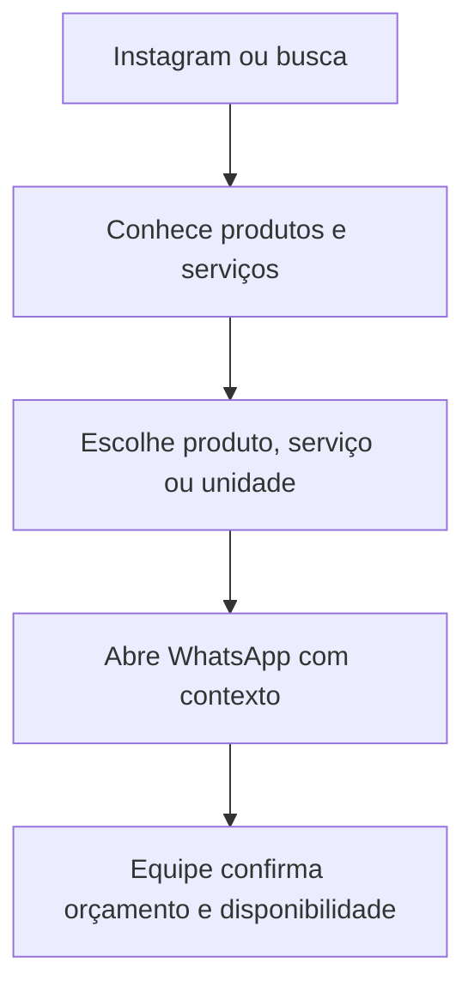

# DESIGN.md — KaKa Pneus & Rodas

## 1. Visão do produto

Criar uma página comercial rápida e responsiva para a KaKa Pneus & Rodas, em Feira de Santana (BA). A experiência deve apresentar produtos e serviços confirmados, mostrar a loja e facilitar um orçamento pelo WhatsApp.

O site complementa o Instagram com informações organizadas e um caminho direto para contato. No MVP, funciona como vitrine digital; não inclui compra, pagamento, frete nem consulta automática de estoque.

## 2. Objetivos da experiência

- Explicar em poucos segundos o que a loja oferece e onde atua.
- Ajudar o visitante a entender como consultar um produto e pedir orçamento.
- Exibir pneus, rodas, veículos e espaço físico com imagens reais autorizadas.
- Tornar o contato simples para pessoas que chegam pelo Instagram ou busca local.
- Evitar informações desatualizadas sobre preço, estoque, horário e unidades.
- Carregar rápido em celular e funcionar bem com conexão móvel.

## 3. Público e contexto de uso

O público provável são motoristas de Feira de Santana e região que pesquisam pneus, rodas e serviços automotivos. Alguns visitantes querem comparar opções; outros querem confirmar rapidamente se há um produto compatível e quanto custa.

Priorizar conteúdo prático: categorias claras, instrução sobre o que informar à equipe e CTA fácil de localizar. A equipe deve confirmar compatibilidade, preço e disponibilidade pelo canal oficial.

## 4. Direção visual

### Conceito

**Automotivo, marcante e acessível.** A página deve transmitir energia e confiança, com fotos de produtos e veículos como protagonistas. Evitar a aparência genérica de concessionária premium ou de loja de peças sem personalidade.

### Paleta de referência

O perfil público apresenta o logotipo amarelo sobre fundo preto. Essa combinação é uma referência observada, não um manual oficial. Usar códigos fornecidos ou aprovados pela KaKa antes da versão final.

| Aplicação | Diretriz |
|---|---|
| Base principal | Preto ou grafite em cabeçalho, rodapé e blocos de destaque |
| Destaques da marca | Amarelo oficial em CTAs, marcadores e pequenos elementos gráficos |
| Fundo de leitura | Branco ou cinza muito claro para textos e conteúdo longo |
| Texto principal | Grafite escuro em fundo claro e branco em fundo escuro |
| Texto secundário | Cinza legível, com contraste suficiente |
| Foco/estados | Indicadores visíveis e acessíveis, sem depender apenas da cor |

Evitar amarelo claro em texto pequeno sobre branco. Conferir contraste em todas as combinações.

### Tipografia

- Usar uma família sans-serif forte e legível para títulos, informações e botões.
- Limitar a duas famílias tipográficas.
- Manter títulos curtos e claros, sem letras estreitas em medidas e informações técnicas.
- Dar destaque visual a medidas apenas quando estiverem confirmadas.
- Preservar o logotipo oficial; não recriar a marca com outra fonte.

### Fotografia

- Priorizar imagens atuais da própria loja, produtos, rodas instaladas e veículos atendidos.
- Usar enquadramentos que mostrem detalhes e contexto real de uso.
- Manter cores e aparência dos produtos fiéis à realidade.
- Não reutilizar fotos de clientes, veículos identificáveis ou publicações de terceiros sem autorização.
- Evitar imagens genéricas que pareçam mostrar produtos disponíveis no estoque.
- Usar vídeos apenas quando aprovados para publicação no site e otimizados para carregamento.

## 5. Arquitetura da página

Página única com navegação por âncoras no MVP. Páginas internas só devem ser adicionadas quando houver conteúdo atualizado para elas.

### 5.1 Cabeçalho

- Logotipo oficial à esquerda.
- Links curtos: Produtos, Serviços, Galeria, Unidades e Contato.
- CTA destacado: **Pedir orçamento**.
- Menu compacto em telas pequenas, acessível por teclado.

### 5.2 Hero

Primeira dobra com:

- Nome KaKa Pneus & Rodas e Feira de Santana, BA.
- Mensagem curta sobre produtos/serviços confirmados.
- Imagem real e aprovada da loja, roda ou veículo.
- CTA primário para orçamento pelo WhatsApp.
- CTA secundário para ver produtos e serviços.

Direção de texto provisória: **“Pneus e rodas para o seu carro, com orçamento direto pelo WhatsApp.”** Ajustar e aprovar com a loja. Não afirmar melhor preço, estoque completo ou resultado garantido.

### 5.3 Produtos e categorias

Apresentar pneus e rodas em grupos visuais claros. Cards podem mostrar:

- Foto aprovada.
- Nome e descrição curta.
- Medidas e aplicações, se confirmadas.
- Nota de que disponibilidade e compatibilidade devem ser confirmadas, quando aplicável.
- CTA de orçamento com contexto do item.

Não publicar uma lista de marcas, medidas, preços ou produtos que não esteja atualizada e validada.

### 5.4 Serviços

Criar seção própria para os serviços que a KaKa confirmar que oferece. Alinhamento e balanceamento são citados em uma listagem comercial pública, mas precisam de confirmação antes de aparecer no site.

Cada serviço deve trazer uma explicação objetiva, unidade responsável (quando houver mais de uma) e opção de consulta pelo WhatsApp.

### 5.5 Galeria

- Mostrar produtos, rodas instaladas, veículos e ambiente da loja.
- Preferir grade de imagens com boa leitura em celular a um carrossel automático.
- Informar contexto sem alegar que o veículo ou produto da imagem está disponível para venda.
- Usar texto alternativo descritivo; imagens decorativas podem ter `alt` vazio.

### 5.6 Como pedir orçamento

Explicar o fluxo em até três passos:

1. Escolha o produto ou serviço.
2. Envie modelo/ano do veículo e medida desejada, se souber.
3. Confirme com a equipe preço, compatibilidade e disponibilidade.

Não sugerir que informações fornecidas pelo visitante substituem a validação da equipe.

### 5.7 Depoimentos

- Publicar apenas depoimentos reais e autorizados.
- Não alterar o sentido de uma fala.
- Não inventar avaliações, notas ou volume de clientes.
- Não tratar depoimento como garantia de resultado ou de experiência idêntica.

### 5.8 Unidades e localização

O Instagram cita uma segunda unidade, mas os dados operacionais devem ser confirmados. Mostrar cards separados apenas depois de receber endereços e contatos oficiais.

Cada unidade pode ter nome, endereço, horário, mapa, serviços disponíveis e WhatsApp, todos validados pela empresa. Não copiar horário de diretório como se fosse informação oficial.

### 5.9 Perguntas frequentes e rodapé

FAQ com respostas aprovadas sobre orçamento, medidas, disponibilidade e localização. No rodapé, incluir logotipo, canais oficiais, endereços confirmados, redes sociais e política de privacidade aplicável.

## 6. Fluxo de conversão



- Repetir o CTA em pontos naturais: cabeçalho, hero, cards e contato final.
- Usar o link oficial de WhatsApp fornecido pela loja.
- Pré-preencher uma mensagem curta, editável e específica para o item escolhido.
- Evitar formulários longos, pop-ups, urgência artificial ou contadores regressivos.
- Um botão fixo no mobile é opcional e não pode encobrir conteúdo ou controles.

Mensagem inicial sugerida:

```text
Olá! Vim pelo site da KaKa Pneus & Rodas e gostaria de um orçamento.
Meu veículo é [modelo/ano] e procuro [produto ou serviço].
```

## 7. Componentes

- `SiteHeader`: logotipo, navegação e CTA.
- `HeroSection`: proposta, cidade, imagem e CTA.
- `ProductCategory` e `ProductCard`: categorias e itens confirmados.
- `ServicesSection`: serviços validados.
- `GalleryGrid`: fotos autorizadas.
- `QuoteSteps`: instruções para orçamento.
- `TestimonialCard`: depoimento autorizado.
- `LocationsSection`: informações confirmadas das unidades.
- `FAQAccordion`: dúvidas aprovadas.
- `WhatsAppCTA`: links centralizados e mensagens contextuais.
- `SiteFooter`: contatos e links oficiais.
- `MobileQuoteAction`: CTA móvel opcional.

Dados de produtos, serviços, unidades e WhatsApp devem vir de um único local para facilitar revisão e atualização.

## 8. Comportamento responsivo

- Projetar mobile-first, considerando visitas vindas de redes sociais.
- Em telas pequenas, empilhar conteúdo e manter o CTA visível sem competir com a leitura.
- Em telas maiores, usar grids e limites de largura para preservar hierarquia.
- Não esconder informação essencial em hover.
- Evitar tabelas largas; apresentar especificações em cards ou linhas que possam quebrar.
- Validar em pelo menos 360 px, 390 px, 768 px, 1024 px e 1440 px.

## 9. Acessibilidade

- Contraste suficiente para texto, botões e estados.
- HTML semântico e hierarquia correta de títulos.
- Links, menu e acordeões operáveis por teclado.
- Foco visível e não coberto por elementos fixos.
- Botões com rótulos claros e áreas de toque adequadas.
- Texto alternativo informativo em imagens relevantes.
- Respeitar redução de movimento configurada no sistema.

## 10. Conteúdo, confiança e privacidade

- Confirmar serviços, estoque, preços, marcas, medidas, garantia, endereços, horários e contatos com a KaKa.
- Usar imagens e depoimentos somente com autorização.
- Não prometer “menor preço”, disponibilidade total ou resultados garantidos sem comprovação.
- Preferir que a pessoa inicie contato no WhatsApp em vez de coletar dados em formulário.
- Se houver analytics, medir apenas eventos necessários (clique em orçamento/rota), sem registrar mensagens ou dados pessoais.
- Revisar privacidade antes de adicionar pixels, cookies não essenciais ou formulários.

## 11. Requisitos técnicos e desempenho

- Seguir a stack definida em `AGENTS.md` e preservar o gerenciador de pacotes do repositório.
- Otimizar imagens e definir suas dimensões para evitar mudança de layout.
- Carregar com prioridade somente o conteúdo essencial da primeira dobra.
- Usar lazy loading abaixo da primeira dobra.
- Reduzir JavaScript e dependências; evitar animações pesadas.
- Configurar metadata, Open Graph, sitemap e SEO local com dados confirmados.
- Não criar backend, estoque integrado ou painel administrativo no MVP.

## 12. Métricas opcionais

Se a loja aprovar analytics e sua configuração de privacidade, acompanhar:

- Clique no CTA de orçamento.
- Clique de WhatsApp por produto/serviço.
- Clique em rota ou seleção de unidade.

Não registrar conteúdo das mensagens, telefones dos visitantes ou dados desnecessários.

## 13. Critérios de aceite

- O visitante entende em poucos segundos o que a KaKa oferece e como pedir orçamento.
- A página funciona bem em celular e desktop.
- Os CTAs usam o WhatsApp oficial e mensagens editáveis.
- Produtos, serviços, fotos, endereços, horários e depoimentos foram confirmados/autorizados.
- Não há preço, estoque, garantia ou alegação inventados.
- A navegação é acessível por teclado e os textos têm contraste legível.
- Imagens carregam eficientemente; não há links quebrados nem placeholders públicos.
- SEO local usa somente informações confirmadas.

## 14. Materiais ainda necessários

- Logotipo oficial e paleta de marca aprovada.
- Catálogo atualizado de pneus, rodas, marcas, medidas e serviços.
- Fotos próprias da loja, produtos e trabalhos com autorização.
- Endereços, horários, mapas, serviços e WhatsApp de cada unidade.
- Depoimentos autorizados, se forem usados.
- Decisão sobre preços e disponibilidade publicados.
- Aprovação do texto principal e das perguntas frequentes.
- Domínio, hospedagem e política de privacidade aplicável.
